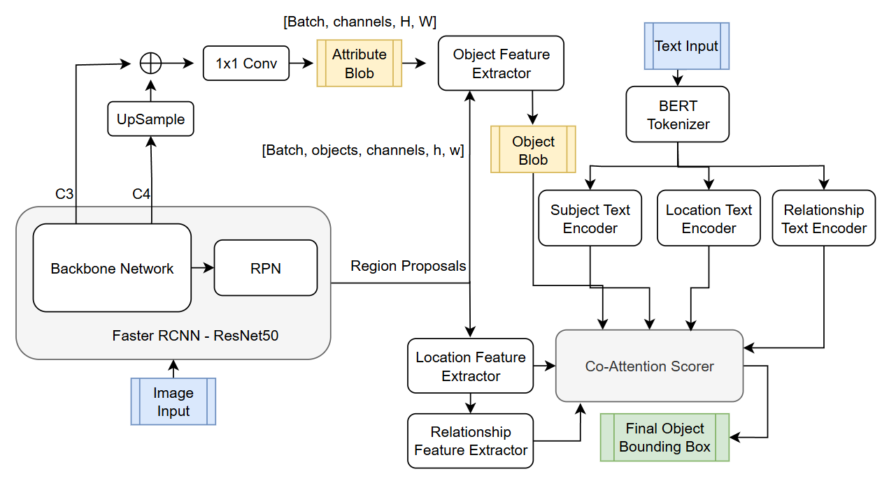
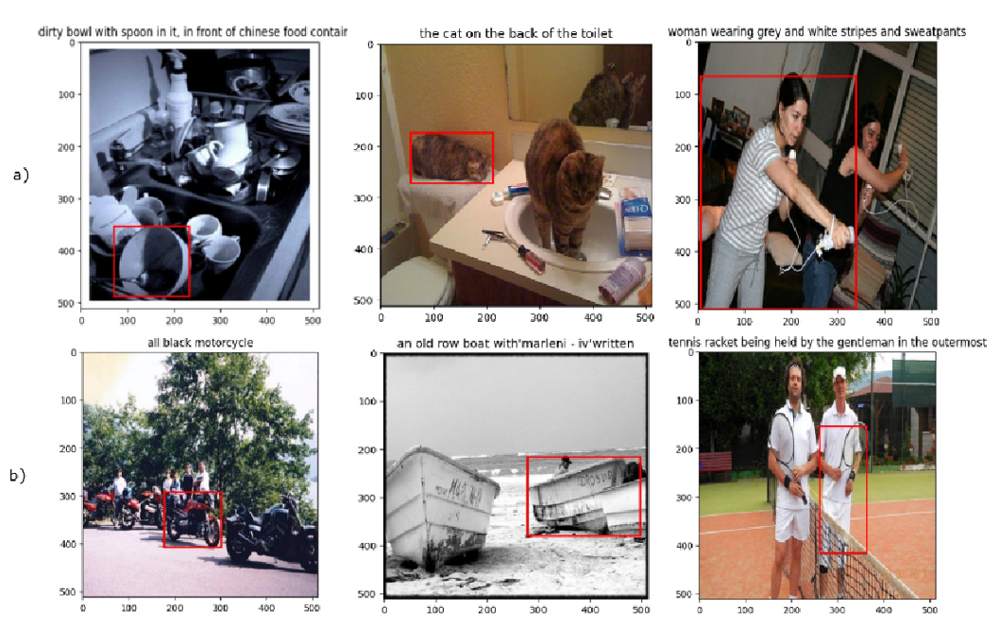

# Visual-Grounding: Grounding Natural Language in Visual Chaos

A PyTorch-based visual grounding model that combines co-attention fusion with modular reasoning to localize image regions from natural language referring expressions.  

---

## 📖 Overview

Real-world referring expressions often require attribute, spatial and relational reasoning to pinpoint the correct object. Our two-stage architecture first extracts region proposals via a pretrained Faster R-CNN and then performs multi-step, module-specific reasoning using visual and textual features through a co-attention mechanism for interpretable, robust grounding .

<!-- --- -->

## 🏗 Model Architecture

<!--  -->

1. **Region Proposal Extraction**  
   - Use Faster R-CNN (ResNet-50) to generate top-10 candidate boxes.  
   - Fuse C3 (textures/colors) and upsampled C4 (edges/contours) feature maps with a 1×1 conv for attribute features.

2. **Modular Visual Features**  
   - **Attribute**: RoI-Align → per-region descriptors  
   - **Location**: Normalize box centers, widths, heights → 5-D location vectors  
   - **Relationship**: Compute Δx, Δy to five nearest neighbors → relational cues

3. **Specialized Text Encoders**  
   - Three independent custom text encoders (attribute, location, relationship) to emphasize relevant tokens (e.g., “striped”, “behind”, “on top of”).

4. **Co-Attention Fusion & Scoring**  
   - Bidirectional co-attention aligns visual features with text embeddings per module.  
   - Cross-module attention merges multi-modal context.  
   - MLP classifier ranks candidate boxes; outputs probability over top-10 proposals.

<!-- --- -->

## 📚 Dataset & Preprocessing

- **RefCOCOg (20% subset)**  
  – ~10 k train, 1 k val, 1 k test pairs  
  – Avg. 5–6 words/expression over everyday scenes  
- **Preprocessing**  
  - Resize images to 512×512, normalize to ImageNet stats  
  - Tokenize expressions (max length 15), pair with GT box :contentReference[oaicite:5]{index=5}  

<!-- --- -->

## 🏋️ Training

- **Epochs**: 40  
- **Frozen**: Faster R-CNN backbone  
- **Fine-tuned**: Text encoders & co-attention module  
- **Mitigations**:  
  - Randomly shuffle proposals each epoch to remove positional bias (+3 % acc)  
  - Adopt independent text encoders per module (+6 % acc) :contentReference[oaicite:6]{index=6}

<!-- --- -->

## 📊 Results

In the image above, the top row shows examples the model predicted correctly, while the bottom row illustrates the cases where its predictions were incorrect.

| Metric            | Score        |
|-------------------|--------------|
| Top-1 Accuracy    | 54.5 %       |
| Top-5 Accuracy    | 85.2 %       |  
> Failure cases (ambiguous text) highlight need for uncertainty estimation.

<!-- --- -->

## 🔍 Key Insights

- **Precise Language Matters**: Ambiguity degrades performance.  
- **Step-wise Reasoning**: Modular breakdown yields interpretability & robustness.  
<!-- - **Module-wise Strengths**:  
  - Attribute excels on color/texture cues  
  - Location handles spatial phrases  
  - Relationship captures inter-object relations -->

<!-- --- -->

<!-- ## ⚠️ Limitations & Next Steps

**Limitations**  
1. No confidence estimates for ambiguous cases  
2. Dependence on proposal quality/diversity  
3. Scalability to full/other datasets  
4. Lack of real-time user feedback integration

**Next Steps**  
- Integrate scene-graphs for richer relationships  
- Dynamic proposal filtering before reasoning  
- Train on full RefCOCOg, RefCOCO+ & RefCOCOg-umd  
- Incorporate reinforcement-learning for online correction

--- -->

## 🤝 Ethical Considerations

Visual grounding in real-world settings risks bias, privacy intrusions and unexplainable decisions. Future work should include bias audits, low-confidence alerts, and transparent grounding logs to ensure fair, accountable deployment.

<!-- --- -->

<!-- ## 📑 Citation

If you use this project, please cite:

> Vamshi, S. & Paithankar, S. “Grounding Natural Language in Visual Chaos,” CSCI 5922 Final Project, University of Colorado Boulder (2025). :contentReference[oaicite:12]{index=12}

---

## 📄 License

Released under the **MIT License**. See [LICENSE](LICENSE) for details.   -->
